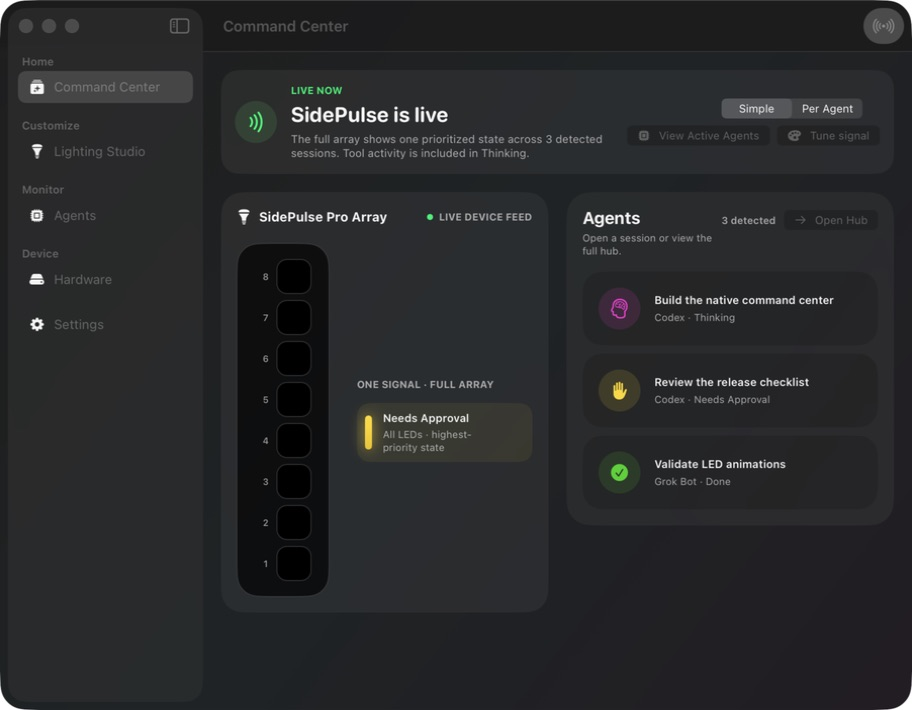

# SidePulse Z

[](https://github.com/zschwendi/sidepuls-z-swift/actions/workflows/build.yml)
[](LICENSE)

SidePulse Z is a native macOS app for seeing what your AI coding agents are doing. It was made for [SidePulse](https://sidepulse.io) products, so agent states can appear on the lights beside your screen. You do not need the hardware: the menu bar and Agent Hub work on their own. It runs locally and does not require a SidePulse account. SidePulse Z is an independent community project, not an official InteliWEAR app.



## Features

- Tracks Codex sessions and experimental Grok Bot activity without a Python runtime.
- Accepts existing SidePulse hook events, so Python-installed integrations still work when present.
- Simple mode shows one prioritized signal; Per Agent mode gives each active agent its own LEDs.
- Uses magenta for working, yellow for approval, green for finished, and red for failed.
- Keeps the physical lights, live array, and animated menu-bar icon in sync.
- Opens an agent directly from the menu bar or Agent Hub.
- Includes custom colors, animations, brightness, SidePulse Pro RGB color balance, battery indicators, profiles, and Focus automation.
- Adds a full-brightness white flashlight that can override lighting or sit behind agent animations.
- Puts Microphone, Timer, and optional SidePulse Notch controls beside Flashlight in the main toolbar and menu-bar popover.
- Shows microphone activity without recording audio, with hardware-mute status when the device exposes it. App-specific software mute is not a reliable system signal.
- Includes a customizable countdown with pause/resume, a warning color, and a finished signal. Its countdown stays visible while running and catches up after system sleep.
- Adds Progress in Lighting Studio: run a command or watch an existing process, with customizable running, finished, and failed signals.
- Drives SidePulse Pro and SidePulse Dot as standalone outputs; neither device requires the other.
- Keeps SidePulse Pro mounted through software eject attempts after lock or hibernate.
- Lets each SidePulse use this Mac, one nearby Mac, or all discovered Macs over Bonjour.
- Filters internal child-agent noise while keeping top-level sessions accessible.

## Build and run

SidePulse Z requires macOS 26.5 or later and Xcode 26.6 or later.

```sh
git clone https://github.com/zschwendi/sidepuls-z-swift.git
cd sidepuls-z-swift
open sidepuls-z-swift.xcodeproj
```

Select the `sidepuls-z-swift` scheme, choose your Apple development team if Xcode asks, and press Run. SidePulse Pro and SidePulse Dot work independently, and hardware is optional.

Run the smoke tests with:

```sh
./scripts/test.sh
```

The repository currently ships as source rather than a notarized macOS download.

## Utility modes

Open **Settings → Modes** to customize microphone and timer colors, colorways,
motion, intensity, and speed. The notch has its own brightness control and is
disabled by default; its colors mirror the selected lighting. Selecting a mode
uses it for the LEDs without changing your agent profiles. **Agent lighting**
returns to your existing setup. Timers keep counting if you select another mode.

Open **Lighting Studio → Progress** to run a command in a chosen folder or watch
a process by its PID. Running a command records its exit status. Watching an
existing process only observes when it exits, so its success or failure is
unknown. Stopping that watcher does not stop the watched process.

Tasks with no reported percentage show an ongoing animation. A command can
report real percentage updates by printing whole-number lines to standard output:

```text
SIDEPULSE_PROGRESS=25
SIDEPULSE_PROGRESS=100
```

The finished or failed signal remains until cleared. **Open Log** opens the
bounded local output log for a command. Progress only runs commands explicitly
started with **Run & Watch**; app launch never reruns a saved command.
Quitting SidePulse cancels commands it started. Processes you only watch are
left running.

## Project links

- [Contributing](CONTRIBUTING.md)
- [Security](SECURITY.md)
- [MIT License](LICENSE)
- [Upstream attribution](NOTICE)

SidePulse hardware, its LED format, and the original SidePulse software were created by [Peter Kuhar / InteliWEAR](https://github.com/inteliwear/sidepulse).
