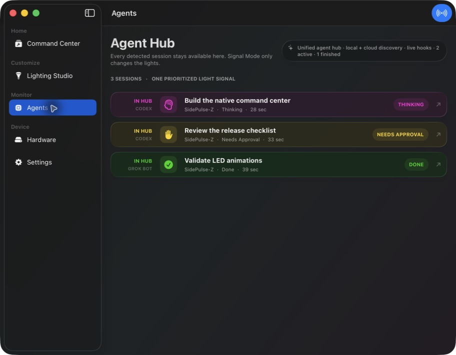
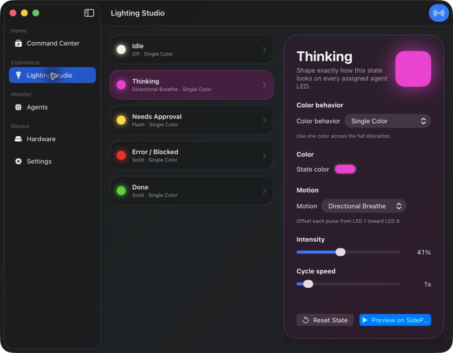
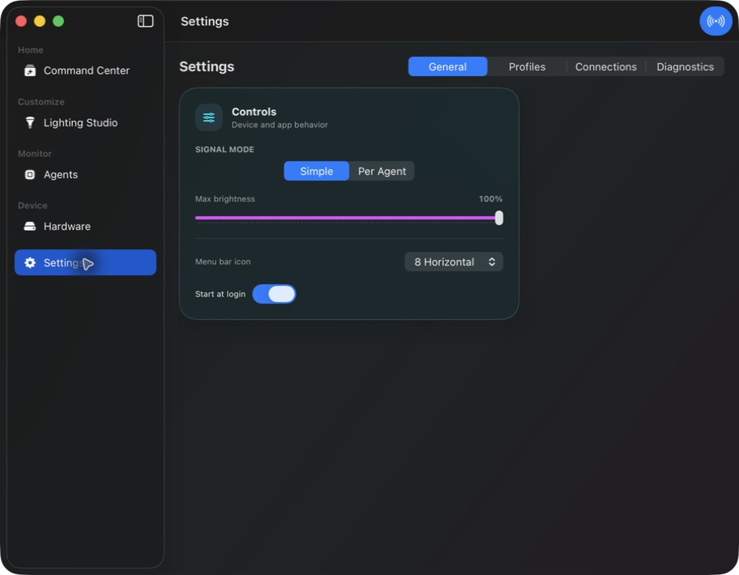

# SidePulse Z

[](https://github.com/zschwendi/sidepuls-z-swift/actions/workflows/build.yml)
[](LICENSE)

SidePulse Z is a native SwiftUI command center for [SidePulse](https://sidepulse.io) hardware. It turns local coding-agent activity into a glanceable physical signal, mirrors that signal in the macOS menu bar, and keeps every detected session one click away in Agent Hub.


> [!IMPORTANT]
> SidePulse hardware and the original SidePulse software were created by Peter Kuhar and InteliWEAR. SidePulse Z is an independent community project and is not an official InteliWEAR application.

## What it does

- Drives the eight-LED SidePulse Pro directly from a native macOS app.
- Discovers local Codex sessions and merges supported Grok Bot activity into one Agent Hub.
- Offers two signal modes:
  - **Simple:** the full array shows the most actionable state.
  - **Per Agent:** stable LED allocations let several sessions share the array without constantly reshuffling.
- Keeps the menu-bar LEDs, live software array, and physical hardware on the same color and animation program.
- Opens a detected session directly from Agent Hub or the menu-bar popover.
- Shows battery level on configured lid events and supports recurring low-battery reminders.
- Provides per-state colors, motion, intensity, speed, brightness, profiles, and Focus automation.
- Runs locally by default with no SidePulse account or analytics service.

## Signal language

| State | Default signal | Meaning |
| --- | --- | --- |
| Thinking | Magenta directional breathe | An agent is actively working. Tool activity is intentionally folded into this state in Simple mode. |
| Needs approval | Yellow flash | A user decision or permission is required. |
| Done | Solid green | Work finished and remains visible until acknowledged. |
| Failed | Solid red | The overall run stopped unsuccessfully. Recoverable tool errors do not count. |
| Idle | Off | No agent needs attention. |

Simple mode resolves competing states in this order: **failure → approval → thinking → done**.

Per Agent mode uses stable allocations for SidePulse Pro: one session receives all eight LEDs, two receive four each, three receive two each, four receive two each, and larger sets use one LED per session. At most the eight most relevant sessions are displayed.

## Screenshots

### Agent Hub

Every detected top-level session remains available here, even when Simple mode condenses the hardware into one signal.



### Lighting Studio

Colors, motion, intensity, and cycle speed are editable for each agent state.



### Settings

Signal mode, hardware brightness, menu-bar layout, profiles, integrations, diagnostics, and startup behavior stay in the Command Center instead of crowding the menu-bar popover.



## Requirements

- macOS 26.5 or later
- Xcode 26.6 or later
- SidePulse Pro for physical output

SidePulse Pro is the primary tested hardware target. SidePulse Dot and dual-device paths exist in the codebase but are experimental and are not part of the current support promise.

For clarity, this is a macOS app. Direct Mac-mounted hardware still uses the `LEDS.LED` path. This app does not implement Peter Kuhar's APNs path for a SidePulse Dot attached to an iPhone; that iOS delivery path is outside the current support promise.

Current agent support:

| Provider | Status |
| --- | --- |
| Codex Desktop | Supported through local session discovery and live IPC state. |
| Codex cloud tasks | Discovered through the locally authenticated Codex CLI when available. |
| Grok Bot | Experimental local persistence discovery. |
| Generic Grok and Claude hooks | Event ingestion exists; turnkey setup is not yet packaged. |

## Nearby Mac mirroring (experimental)

Nearby Mac mirroring is explicitly opt-in and defaults to **Off**. It uses Bonjour service `_sidepulse-z._tcp` and is intended for Macs on the same local LAN. Modes other than Off require macOS Local Network permission; Bonjour discovery can also be blocked by guest networks, VPNs, or network isolation.

| Mode | Behavior |
| --- | --- |
| **Off** | Keep this Mac's local signal only; do not publish or follow nearby signals. |
| **Share This Mac** | Publish this Mac's signal so nearby Macs can follow it, while this Mac continues showing its local signal. |
| **Follow Nearby Mac** | Follow one selected discovered Mac and show its compiled Pro/Dot light program. |
| **All Macs** | Share this Mac and choose the highest-priority fresh signal across this Mac and discovered Macs. |

The signal payload contains protocol metadata, coarse aggregate state, timing, and Pro/Dot compiled LED programs only. It does not contain agent names, messages, projects, paths, or LED slots. Bonjour discovery does expose a Mac display name and per-instance node identifier so peers can be listed and selected. There is no authentication or pairing yet, so use this feature only on a trusted local network.

Remote frames older than 3.5 seconds stop driving **Follow Nearby Mac**. **All Macs** drops stale remote frames and falls back to another fresh signal, including a fresh local signal when available.

## Build and run

Clone the repository and run the smoke suite:

```sh
git clone https://github.com/zschwendi/sidepuls-z-swift.git
cd sidepuls-z-swift
./scripts/test.sh
```

Build an ad-hoc-signed Release app without inheriting another developer's Apple team:

```sh
xcodebuild \
  -project sidepuls-z-swift.xcodeproj \
  -scheme sidepuls-z-swift \
  -configuration Release \
  -derivedDataPath .build \
  CODE_SIGN_IDENTITY=- \
  DEVELOPMENT_TEAM= \
  build

open .build/Build/Products/Release/SidePulse.app
```

For normal development, open `sidepuls-z-swift.xcodeproj`, select your own Apple development team if Xcode asks, and run the `sidepuls-z-swift` scheme.

The repository does not currently publish a notarized binary. Treat GitHub source archives and locally built apps differently from a signed public macOS release.

## How agent discovery works

The app prefers authoritative local state:

- Codex Desktop IPC for active/waiting state
- local Codex session metadata for discovery and titles
- the local Codex CLI for cloud-task discovery when available
- Grok Bot's local persistence store
- SidePulse hook events received through a local Unix socket

The latest merged snapshot is stored under `${XDG_STATE_HOME:-~/.local/state}/sidepulse/agent-monitor`. The app filters known internal maintenance and child-agent runs from the user-facing hub while retaining legitimate top-level sessions.

## Privacy

SidePulse Z has no analytics SDK, advertising SDK, or SidePulse account. It reads local agent metadata so it can show task titles and states, and it writes LED programs to a mounted SidePulse device when Live Output is enabled. Codex cloud discovery may invoke your existing Codex CLI, which uses that tool's already-configured account and network behavior. Nearby Mac mirroring is separately opt-in and defaults to Off; when enabled, it uses Bonjour on the local network and sends only the protocol metadata, coarse aggregate state, timing, and Pro/Dot compiled LED programs described above.

Before sharing diagnostics, review them for task names, local paths, and agent messages.

## Contributing

See [CONTRIBUTING.md](CONTRIBUTING.md). Bug reports and focused pull requests are welcome. Please use [GitHub's private vulnerability reporting](SECURITY.md) for security-sensitive findings.

## License and attribution

MIT licensed. See [LICENSE](LICENSE) and [NOTICE](NOTICE).

SidePulse hardware, its LED control format, and the original SidePulse software are by [Peter Kuhar / InteliWEAR](https://github.com/inteliwear/sidepulse). This repository preserves the upstream MIT attribution while licensing the native Swift application and contributions under the same permissive terms.
